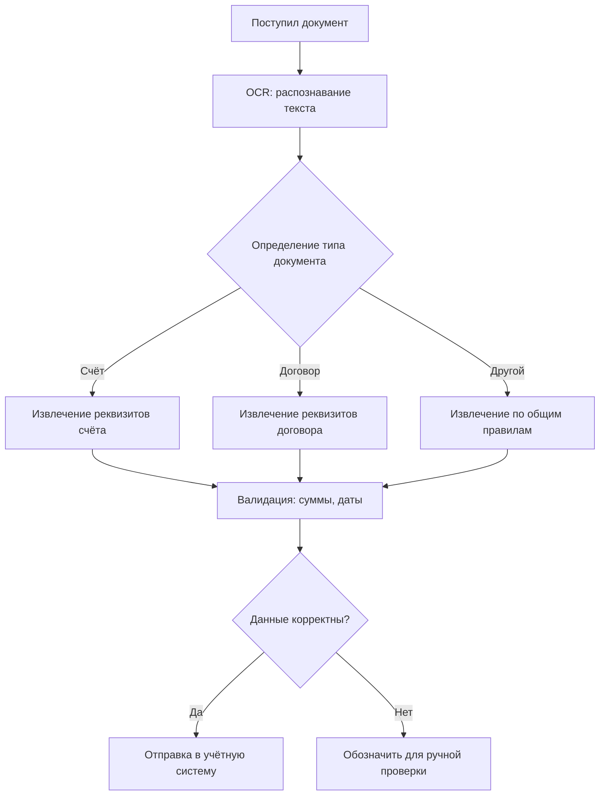

# 4. Автоматизация документов с помощью AI: распознавание, извлечение и проверка данных

**Дата публикации:** 22 июля 2026  
**Автор:** QBit-Studio-Ai  
**Дата обновления:** 25 июля 2026  
**Время чтения:** ~6 минут  

**Краткий ответ:** Автоматизация документооборота с AI включает сканирование/распознавание текста, классификацию документов и извлечение ключевых реквизитов с последующей проверкой. Система берёт на себя рутинную обработку заявлений, счетов, договоров: превращает бумажный или цифровой документ в структурированные данные, сверяет их и передает дальше. Это помогает сократить ручной ввод, ускорить подготовку документов и снизить человеческие ошибки при первичной обработке.

**Что такое автоматизация документов?** Это технология, при которой документы (счета, накладные, акты, заявления и др.) обрабатываются с помощью программ. Шаги автоматизации включают:  
- **OCR (распознавание текста).** Документ (скан/фото/PDF) обрабатывается программой, выделяющей текст (Optical Character Recognition). Система «читает» текстовые поля и цифры.  
- **Классификация документов.** Модель определяет тип документа (счёт, договор, накладная и т.д.) по внешнему виду или ключевым словам.  
- **Извлечение данных.** Из распознанного текста извлекаются нужные поля: номера, даты, суммы, имена участников, логотипы, штрих-коды. Используются регулярные выражения и модели машинного обучения, чтобы найти реквизиты (ИНН, телефон, адрес) и табличные данные (позиции товаров, цены).  
- **Проверка данных.** Извлечённые поля сверяются с базами (например, адреса, ИНН по реестру, даты согласуются с календарём), и при низком уровне уверенности (confidence) система помечает поля для ручной проверки.  
- **Передача в систему.** Результаты (структурированные данные и сам текст) передаются в учётную систему (CRM, ERP) или в бухгалтерию для дальнейшего использования.  

**Кому и когда это подходит:** Автоматизация документов эффективна для компаний, обрабатывающих большой поток стандартных бумаг (счета, заявки, отчёты). Например, в бухгалтерии, логистике, банках и торговле. Особенно полезно там, где документооборот формализован и повторяем. Если документы едва отличаются друг от друга, AI легко обучить их распознавать. Но если каждый документ уникален (сильно различный формат), автоматизация будет сложна. В таких случаях лучше начать с наиболее стандартизированных типов (например, электронных счетов или типовых форм). 

**Бизнес-проблема:** Ручная обработка документов занимает много времени и даёт много ошибок. Менеджеры вводят данные из писем и бумажек вручную, и это требует сверки при любом сомнении. Контроль счетов и договоров «с бумаги на бумагу» замедляет работу: например, реквизиты можно ввести с ошибкой, или пропустить крайний срок оплаты. Автоматизация позволяет это минимизировать: AI быстро «считывает» документ в цифровой форме, а человек проверяет только необычные случаи.

**Рабочий подход:** Настраивается система очередной цепочкой:  
1. **Загрузка документа.** Файл попадает в систему (scan, email, портал).  
2. **OCR и предобработка.** Изображение «очищается» (улучшается контраст, выравнивание) и передаётся OCR-движку.  
3. **Классификация.** На основе метаданных или структуры определяется тип документа (например, ИИ-модель обучена отличать счёт от акта по присутствию слов «счёт», «акт», по расположению полей).  
4. **Извлечение полей.** Для каждого типа документа заложены шаблоны полей: ищутся шаблонные местоположения (номер документа, дата, данные контрагента). Выделяется текст (например, с помощью регулярных выражений на ИНН, сумму, почту) или моделей, распознающих таблицы (Tabular OCR).  
5. **Проверка и валидация.** Система проверяет обязательные поля: все ли заполнены, корректны ли форматы (число, дата), не противоречит ли информация (сумма по строкам = итогу). Если не хватает данных или уверенность низкая, документ отправляется на ручную проверку сотруднику.  
6. **Интеграция.** Извлечённые данные (например, номер счёта и сумма) автоматически заносятся в бухгалтерскую программу или CRM: создаётся новая запись, счет на оплату и т.д. Это экономит время и исключает дубляж данных.

**Этапы внедрения:** 
1. **Сбор образцов документов.** Классические формы и примеры для каждого типа (счета, накладные, заявки) загружаются для обучения.  
2. **Выбор технологий.** Решается, какой OCR использовать (Google Vision, Tesseract, коммерческие решения) и есть ли необходимость в предобученной нейросетевой модели для специфических полей.  
3. **Настройка шаблонов.** Для каждого типа документа: задаются зоны (регионысо строками «Счёт №», «Дата», «Сумма»). Если формат строгий, делают каркас полей.  
4. **Обучение/дообучение модели.** Система «учится» выделять информацию по примерам; она автоматически улучшает распознавание после обратной связи (принятых или исправленных полями).  
5. **Интеграция.** Связывают с базовыми ИТ-системами: через API передают данные о клиентах, документах, суммах. Настраивают создание и обновление записей.  
6. **Запуск и улучшение.** Постепенно добавляют новые типы документов. Следят за качеством распознавания: вносят правки в шаблоны и модели. Проводят регулярные проверки, сравнивая с ручной обработкой первых нескольких десятков документов.

**Проверяемый список критериев:**  
- **Качество OCR:** проверяется процент правильно распознанных символов (особенно цифр и русских букв).  
- **Полнота данных:** все обязательные поля извлечены (ФИО, ИНН, суммы и т.п.).  
- **Правильность значения:** суммы по позициям и итог соответствуют; даты в допустимом формате и диапазоне; почтовые адреса корректны; номера телефонов имеют нормальные коды.  
- **Уровень уверенности:** если автоматическая оценка (confidence) слишком низкая (например, поле «ИИН клиента» прочитано с неопределённостью), документ помечается для ручной проверки.  
- **Совпадение с учётной системой:** проверяется, что извлечённый ИНН/название контрагента правильно соответствует базе (например, сверка по «Карточкам поставщиков»).

**Реальные сценарии:** Рассмотрим условный сценарий со сканом счёта от поставщика. Система OCR извлекает номер счёта, дату, ИНН поставщика, перечень услуг и итоговую сумму. Затем workflow формирует запись в учётной системе и уведомляет ответственного бухгалтера. Если качество изображения не позволяет уверенно извлечь обязательное поле, документ помечается для ручной проверки. Это пример возможной архитектуры, а не описание реализованного проекта.

**Ограничения и условия применения:** Автоматизация документов хорошо работает для **формализованных и типовых форм**. Не стоит ожидать идеальной работы с неструктурированными файлами (например, рукописные заметки) без доработки. Также важное замечание: автоматизация **не даёт юридической оценки** документов. Искусственный интеллект может распознавать текст и проверять пересчёты, но он не определит, является ли договор выгодным или корректным с точки зрения права. Ответственность за критические решения (например, подписание договора) остаётся за людьми. Нельзя использовать AI для создания или изменения содержания договора – только для извлечения и верификации данных.

**Типичные ошибки внедрения:** Популярная ошибка — ожидать, что система «почистит» сами документы (например, исправит все сканы). В реальности лучше заранее обеспечить нормальное качество бумаги/скана и единый формат заполнения. Ещё ошибочно пытаться вытаскивать слишком много из одного OCR-движка: иногда выгоднее комбинировать разные способы (для таблиц использовать специализированные инструменты, для полей — текст). Нельзя автоматически архивировать документы без контроля: важно периодически проверять, что система не пропускает важные строки. 

**Краткий итог:** AI позволяет **ускорить и упростить** обработку бумаг: от распознавания до заполнения систем. Главное — правильно настроить распознавание (OCR), логику извлечения и валидации. **Перед запуском** автообработки документов желательно: сгруппировать шаблоны документов, протестировать работу OCR на нескольких десятках примеров и убедиться в корректности извлечения ключевых полей. Автоматизация пригодна там, где количество документов велико и допуск ошибок должен быть минимален.  

**Источники:**
- В первичном кейсе [«Татспиртпрома» о переходе на налоговый мониторинг](https://www.directum.ru/blog-post/perejjti_na_nalogovyjj_monitoring_za_6_mesjacev__opyt_tatspirtprom) от 25 июня 2024 года указано: точность распознавания документов составила **90%**, в первый месяц ИИ обработал **10 тыс. документов**, а реквизиты документа стали заполняться в системе в **2 раза** быстрее. Эти показатели относятся только к этому проекту.
- В первичном кейсе [УК «Альфа-Капитал» об обработке распоряжений на вывод средств](https://www.directum.ru/document/39311337) сервисы извлекают номер расчётного счёта из скан-образа и сопоставляют его с данными системы за **1,5 минуты**; на странице также указано среднее время обработки одного распоряжения — **97 секунд**. Источник не подтверждает прежнее сравнение с 15 минутами, поэтому оно удалено.

**Материалы по теме:**
- «[AI-обработка и анализ документов](/products/document-analysis)» — продуктовая страница о распознавании, извлечении и проверке данных.  
- «[Что можно автоматизировать на n8n](/blog/chto-mozhno-avtomatizirovat-na-n8n)» — о маршрутизации и контроле workflow.  
- «[Как связать сайт, CRM и мессенджеры](/blog/sayt-crm-i-messendzhery)» — о передаче проверенных данных между системами.
