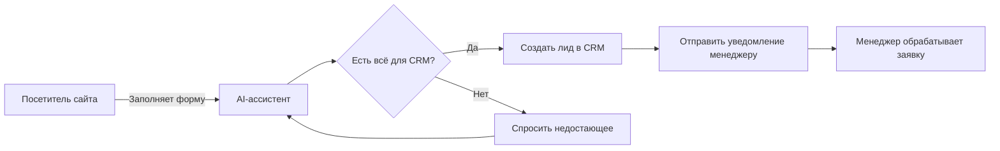

# 1. Автоматизация обработки заявок: как связать сайт, AI-ассистента и CRM

**Дата публикации:** 25 июля 2026  
**Автор:** QBit-Studio-Ai  
**Дата обновления:** 25 июля 2026  
**Время чтения:** ~6 минут  

**Краткий ответ:** Автоматизация обработки заявок объединяет сайт, AI-ассистента и CRM в единый процесс. Ассистент на сайте принимает заявку (форму или чат), уточняет детали при помощи AI (классификация темы, дополнительные вопросы) и создаёт сущность «лид» в CRM. В результате сотрудник получает сразу готовую к обработке заявку с контактами и кратким описанием. Это ускоряет реакцию на обращения и исключает потерю лидов между каналами и сменами.

**Что такое автоматизация заявок?** Это перенесение рутинной части работы приёмной — обработка входящих обращений — на программу с AI. Сайт (или чат, мессенджер) становится одним из каналов входящих заявок. AI-ассистент распознаёт тему обращения, собирает необходимые данные (имя клиента, контакты, суть запроса) и передаёт результат в CRM и менеджеру. Каждый этап (ввод данных, проверка, уведомление) автоматизирован. Ключевое: человек вовлекается только для сложных задач, а всё стандартное выполняется автоматически.

**Кому и когда это подходит?** Автоматизация заявок особенно полезна компаниям, где менеджеры теряют время на одинаковые ответы и обработку однотипных запросов (сервисы, онлайн-школы, малый бизнес). ИИ-ассистент может работать круглосуточно, поэтому нет «мертвых» часов: вечерние и выходные заявки тоже будут обработаны. Это выгодно торговым отделам, где важен быстрый отклик (каждый неотвеченный лид — потерянная продажа), а также сервисным компаниям, где нужно точно следовать инструкциям (AI может хранить сценарии и регламенты).

**Бизнес-проблема без автоматизации:** При ручной обработке заявки утекают в никуда. Например, клиент заполняет форму ночью, а менеджер увидит её только на следующий день. Или поступает много однотипных вопросов, и менеджеры тратят часы на их разбор вместо стратегической работы. Отсутствие объединённого процесса приводит к потерям: заявки между сайтом, почтой и мессенджерами не синхронизируются, менеджеры перезапрашивают данные у клиентов, ничего не сохраняется в CRM. В итоге падает скорость обработки и конверсия.

**Рабочий подход:** Настраивается сквозной сценарий: (1) Событие на сайте (форма, кнопка «заказать», или чат) → (2) AI-ассистент спрашивает уточняющие вопросы (напр., номер заказа, дату, уточнения о проблеме) → (3) Сформированные данные и комментарии передаются в CRM как новая заявка → (4) Менеджер получает уведомление (по e-mail или в мессенджере) с деталями запроса. При этом встроены проверки: если заявка дублирует предыдущую (детекция дубликатов по e-mail/телефону) — ассистент предупредит об этом или объединиет коммуникации; если не хватает персональных данных (ФИО, контакты), бот попросит уточнить, чтобы соблюсти правила обработки данных. Также настраивается резервный маршрут: если CRM недоступна, ассистент хранит заявку локально и пробует отправить позже.  

**Этапы внедрения:** 
1. **Определение сценариев.** Сбор всех каналов, через которые приходят заявки (сайт, чат на сайте, email, мессенджеры). Анализ, какие вопросы приходят чаще всего и какие из них можно решить автоматически.  
2. **Составление проекта.** Описание скрипта AI-ассистента: какие данные он должен собрать, как классифицировать запрос (например, «техподдержка», «продажа», «возврат товара»), когда переводить на человека.  
3. **Настройка AI.** Обучение модели или правил классификации тем заявок. Подключение базы знаний (часто задаваемых вопросов) для ответов или уточнений. Прописание текстовых шаблонов уточняющих вопросов.  
4. **Интеграция с CRM.** Определение, какие поля нужно заполнить в CRM (имя, контакты, суть запроса, дата). Настройка webhook/API для создания сущности «Заявка» или «Лид».  
5. **Тестирование.** Проверка сценариев: корректность вопросов, правильность создания заявки в CRM, работа уведомлений. Важно протестировать и «сложные» кейсы: повторные обращения, неточное указание данных, запросы на личные данные.  
6. **Запуск и контроль.** Постепенный запуск в один канал (например, веб-форма), мониторинг выхлопа: сколько заявок прошло автоматически, сколько перенаправлено на человека. Сбор обратной связи от менеджеров по корректности классификации и полноте данных.

**Критерии проверки:** Перед автоматизацией важно иметь: фиксированную последовательность действий (сценарий), шаблоны вопросов/ответов и чёткие критерии, когда привлекать человека. Например, можно автоматически обрабатывать **повторяющиеся и стандартизированные обращения** (опрос по форме), но **сложные или юридически значимые запросы** ассистент должен передавать человеку. Также проверяется: корректность заполнения всех обязательных полей CRM, качество классификации (AI должен правильно определять тему), время реакции (сколько секунд/минут уходит на полное ответ и создание лида). **Контрольный список** может включать: 
- все необходимые поля CRM заполнены (контакт, адрес, суть)  
- клиент получил подтверждение приёма заявки  
- заявка не потерялась (есть журнал или бекап)  
- нет очевидных дубликатов (AI умеет их выявлять)  
- ограничена передача персональных данных (GDPR/ФЗ-152) – если не хватает согласия, система не хранит лишнюю информацию.

**Реальные сценарии:** В качестве условного примера: посетитель заполняет на сайте форму заявки на сервис. AI-ассистент уточняет номер договора и дату покупки (если нужно), фиксирует контактные данные. Затем автоматически создаётся лид в CRM (например, Bitrix24 или amoCRM). Менеджер получает уведомление и видит в описании заявки: «Клиент Иванов Петр, вопрос: настройка нового тарифа, номер договора 12345». Ему не нужно переписывать детали — они уже структурированы ботом. Другой сценарий: запрос через чат Telegram — бот опросит клиента, сформирует обращение аналогичным образом. Если к заявке прикрепляются документы (скриншоты проблемы), ассистент может сохранить их в CRM или отправить в общую папку.

**Ограничения и условия применения:** Автоматизация эффективна для **типовых обращений с предсказуемым ответом или обработкой** (статус заказа, подключение услуги, запись на приём и т.п.). Она НЕ подходит для запросов, требующих индивидуальных решений (например, сложные юридические консультации) или когда решение критично для безопасности — в таких случаях AI-ассистент должен отказывать с переходом на живого специалиста. В чат-боте следует всегда предусмотреть «остановку» — объяснение, что вопрос передан менеджеру. Кроме того, нужно соблюдать регламент обработки персональных данных: AI-ассистент должен запрашивать разрешение на сбор контактов и не передавать в CRM лишние данные без согласия. 

**Типичные ошибки внедрения:** Часто ассистент сразу пытаются сделать «на всё и сразу» — тогда он начинает путаться в сценариях. Оптимально начинать с одного типа обращений (например, заявки через сайт) и расширять функционал. Ещё одна ошибка — полагаться на непроверенный ИИ-бэкэнд: алгоритмы классификации нужно настраивать на реальные примеры запросов компании. Нельзя сразу дублировать существующие маркетинговые тексты — бот должен «говорить человеческим языком». И, конечно, не стоит жёстко утверждать, что система «на 100% заменит менеджеров» — в статье подчёркивается, что цель ассистента **сократить рутину**, а не полностью «уволить» сотрудников. 

**Краткий итог:** Автоматизация обработки заявок связывает сайт, AI и CRM, помогая принимать, уточнять и передавать заявки по единому сценарию. Она сокращает ручные переходы между каналами и позволяет отвечать сразу после проверки необходимых данных. **Перед внедрением** зафиксируйте текущий процесс, объём обращений и цели автоматизации. Это поможет чётко определить, какие этапы действительно передавать AI, а какие — оставить за человеком. 

**Источники:**
- По данным [ИСИЭЗ НИУ ВШЭ о применении ИИ в российских компаниях](https://issek.hse.ru/news/1083541394.html), опубликованным 12 сентября 2025 года, анализ основан на обследовании свыше 15 тыс. крупных и средних организаций — пользователей ИИ за 2024 год. Среди этих организаций свыше половины применяли ИИ в маркетинге и продажах, производстве продукции и оказании услуг, а также управлении персоналом.
- В официальном сообщении [«Ростелеком Контакт-центр» об итогах первого года применения LLM и речевой аналитики](https://www.company.rt.ru/press/news/d472799/) от 25 марта 2025 года указано, что в этом контакт-центре скорость получения ответов клиентами выросла в **7 раз**, а производительность труда операторов — на **21%**. Это показатели конкретного кейса, а не рынка в целом.

**Материалы по теме:**
- «[Единый сбор заявок в CRM](/products/leads-to-crm)» — продуктовая страница о передаче обращений в CRM.  
- «[AI-ассистент по базе знаний: как работает RAG](/blog/ai-assistent-po-baze-znaniy)» — о поиске ответов в документах и контроле качества.  
- «[Как связать сайт, CRM и мессенджеры](/blog/sayt-crm-i-messendzhery)» — о передаче и проверке заявок между каналами.
